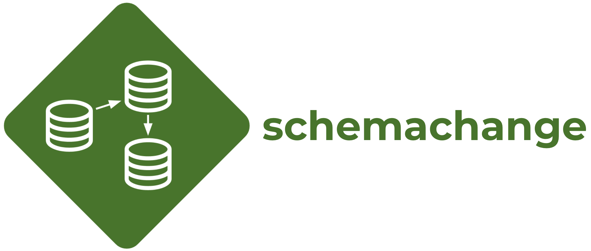
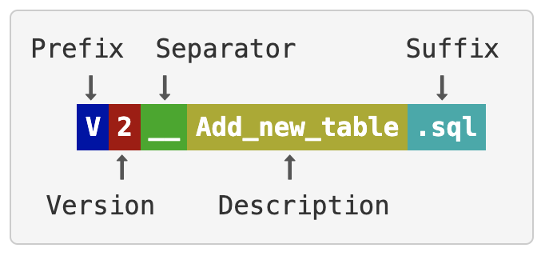
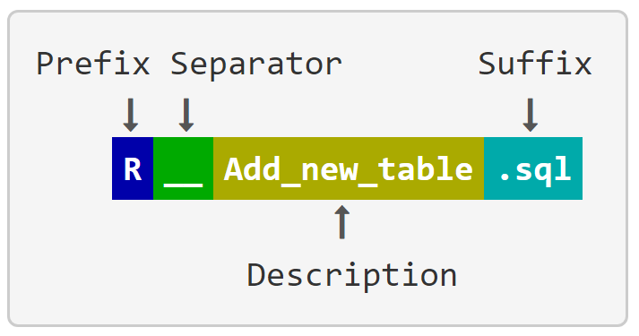

# schemachange


*Looking for snowchange? You've found the right spot. snowchange has been renamed to schemachange.*

## Overview

schemachange is a simple python based tool to manage all of your [Snowflake](https://www.snowflake.com/) objects. It follows an Imperative-style approach to Database Change Management (DCM) and was inspired by the [Flyway database migration tool](https://flywaydb.org). When combined with a version control system and a CI/CD tool, database changes can be approved and deployed through a pipeline using modern software delivery practices. As such schemachange plays a critical role in enabling Database (or Data) DevOps.

DCM tools (also known as Database Migration, Schema Change Management, or Schema Migration tools) follow one of two approaches: Declarative or Imperative. For a background on Database DevOps, including a discussion on the differences between the Declarative and Imperative approaches, please read the [Embracing Agile Software Delivery and DevOps with Snowflake](https://www.snowflake.com/blog/embracing-agile-software-delivery-and-devops-with-snowflake/) blog post.

For the complete list of changes made to schemachange check out the [CHANGELOG](CHANGELOG.md).

**Please note** that schemachange is a community-developed tool, not an official Snowflake offering. It comes with no support or warranty.

## Table of Contents

1. [Overview](#overview)
1. [Project Structure](#project-structure)
   1. [Folder Structure](#folder-structure)
1. [Change Scripts](#change-scripts)
   1. [Versioned Script Naming](#versioned-script-naming)
   1. [Repeatable Script Naming](#repeatable-script-naming)
   1. [Always Script Naming](#always-script-naming)
   1. [Script Requirements](#script-requirements)
   1. [Using Variables in Scripts](#using-variables-in-scripts)
      1. [Secrets filtering](#secrets-filtering)
   1. [Jinja templating engine](#jinja-templating-engine)
1. [Change History Table](#change-history-table)
1. [Authentication](#authentication)
   1. [Password Authentication](#password-authentication)
   1. [Private Key Authentication](#private-key-authentication)
   1. [Oauth Authentication](#oauth-authentication)
   1. [External Browser Authentication](#external-browser-authentication)
   1. [Okta Authentication](#okta-authentication)
1. [Configuration](#configuration)
   1. [YAML Config File](#yaml-config-file)
      1. [Yaml Jinja support](#yaml-jinja-support)
   1. [Command Line Arguments](#command-line-arguments)
1. [Running schemachange](#running-schemachange)
   1. [Prerequisites](#prerequisites)
   1. [Running The Script](#running-the-script)
1. [Getting Started with schemachange](#getting-started-with-schemachange)
1. [Integrating With DevOps](#integrating-with-devops)
   1. [Sample DevOps Process Flow](#sample-devops-process-flow)
   1. [Using in a CI/CD Pipeline](#using-in-a-cicd-pipeline)
1. [Maintainers](#maintainers)
1. [Third Party Packages](#third-party-packages)
1. [Legal](#legal)


## Project Structure

### Folder Structure

schemachange expects a directory structure like the following to exist:
```
(project_root)
|
|-- folder_1
    |-- V1.1.1__first_change.sql
    |-- V1.1.2__second_change.sql
    |-- R__sp_add_sales.sql
    |-- R__fn_get_timezone.sql
|-- folder_2
    |-- folder_3
        |-- V1.1.3__third_change.sql
        |-- R__fn_sort_ascii.sql
```

The schemachange folder structure is very flexible. The `project_root` folder is specified with the `-f` or `--root-folder` argument. Under the `project_root` folder you are free to arrange the change scripts any way you see fit. You can have as many subfolders (and nested subfolders) as you would like.

## Change Scripts

### Versioned Script Naming

Versioned change scripts follow a similar naming convention to that used by [Flyway Versioned Migrations](https://flywaydb.org/documentation/migrations#versioned-migrations). The script name must follow this pattern (image taken from [Flyway docs](https://flywaydb.org/documentation/migrations#versioned-migrations)):



With the following rules for each part of the filename:

* **Prefix**: The letter 'V' for versioned change
* **Version**: A unique version number with dots or underscores separating as many number parts as you like
* **Separator**: __ (two underscores)
* **Description**: An arbitrary description with words separated by underscores or spaces (can not include two underscores)
* **Suffix**: .sql or .sql.jinja

For example, a script name that follows this convention is: `V1.1.1__first_change.sql`. As with Flyway, the unique version string is very flexible. You just need to be consistent and always use the same convention, like 3 sets of numbers separated by periods. Here are a few valid version strings:

* 1.1
* 1_1
* 1.2.3
* 1_2_3

Every script within a database folder must have a unique version number. schemachange will check for duplicate version numbers and throw an error if it finds any. This helps to ensure that developers who are working in parallel don't accidently (re-)use the same version number.

### Repeatable Script Naming

Repeatable change scripts follow a similar naming convention to that used by [Flyway Versioned Migrations](https://flywaydb.org/documentation/concepts/migrations.html#repeatable-migrations). The script name must follow this pattern (image taken from [Flyway docs](https://flywaydb.org/documentation/concepts/migrations.html#repeatable-migrations):



e.g:

* R__sp_add_sales.sql
* R__fn_get_timezone.sql
* R__fn_sort_ascii.sql

All repeatable change scripts are applied each time the utility is run, if there is a change in the file.
Repeatable scripts could be used for maintaining code that always needs to be applied in its entirety. e.g. stores procedures, functions and view definitions etc.

Just like Flyway, within a single migration run, repeatable scripts are always applied after all pending versioned scripts have been executed. Repeatable scripts are applied in the order of their description.

### Always Script Naming

Always change scripts are executed with every run of schemachange. This is an addition to the implementation of [Flyway Versioned Migrations](https://flywaydb.org/documentation/concepts/migrations.html#repeatable-migrations).
The script name must following pattern:

`A__Some_description.sql`

e.g.

* A__add_user.sql
* A__assign_roles.sql

This type of change script is useful for an environment set up after cloning. Always scripts are applied always last.

### Script Requirements

schemachange is designed to be very lightweight and not impose to many limitations. Each change script can have any number of SQL statements within it and must supply the necessary context, like database and schema names. The context can be supplied by using an explicit `USE <DATABASE>` command or by naming all objects with a three-part name (`<database name>.<schema name>.<object name>`). schemachange will simply run the contents of each script against the target Snowflake account, in the correct order.

### Using Variables in Scripts
schemachange supports the jinja engine for a variable replacement strategy. One important use of variables is to support multiple environments (dev, test, prod) in a single Snowflake account by dynamically changing the database name during deployment. To use a variable in a change script, use this syntax anywhere in the script: `{{ variable1 }}`.

To pass variables to schemachange, check out the [Configuration](#configuration) section below. You can either use the `--vars` command line parameter or the YAML config file `schemachange-config.yml`. For the command line version you can pass variables like this: `--vars '{"variable1": "value", "variable2": "value2"}'`. This parameter accepts a flat JSON object formatted as a string. Nested objects and arrays don't make sense at this point and aren't supported.

schemachange will replace any variable placeholders before running your change script code and will throw an error if it finds any variable placeholders that haven't been replaced.

#### Secrets filtering
While many CI/CD tools already have the capability to filter secrets, it is best that any tool also does not output secrets to the console or logs. Schemachange implements secrets filtering in a number of areas to ensure secrets are not writen to the console or logs. The only exception is the `render` command which will display secrets.

A secret is just a standard variable that has been tagged as a secret. This is determined using a naming convention and either of the following will tag a variable as a secret:
1. The variable name has the word secret in it.
   ```yaml
      config-version: 1
      vars:
         bucket_name: S3://......  # not a secret
         secret_key: 567576D8E  # a secret
   ```
2. The variable is a child of a key named secrets.
   ```yaml
      config-version: 1
      vars:
      secrets:
         my_key: 567576D8E # a secret
      aws:
         bucket_name: S3://......  # not a secret
         secrets:
            encryption_key: FGDSUUEHDHJK # a secret
            us_east_1:
               encryption_key: sdsdsd # a secret
   ```

### Jinja templating engine
schemachange uses the Jinja templating engine internally and supports: [expressions](https://jinja.palletsprojects.com/en/3.0.x/templates/#expressions), [macros](https://jinja.palletsprojects.com/en/3.0.x/templates/#macros), [includes](https://jinja.palletsprojects.com/en/3.0.x/templates/#include) and [template inheritance](https://jinja.palletsprojects.com/en/3.0.x/templates/#template-inheritance).

These files can be stored in the root-folder but schemachange also provides a separate modules folder `--modules-folder`. This allows common logic to be stored outside of the main changes scripts. The [demo/citibike_jinja](demo/citibike_jinja) has a simple example that demonstrates this.

The Jinja autoescaping feature is disabled in schemachange, this feature in Jinja is currently designed for where the output language is HTML/XML. So if you are using schemachange with untrusted inputs you will need to handle this within your change scripts.

## Change History Table

schemachange records all applied changes scripts to the change history table. By default schemachange will attempt to log all activities to the `METADATA.SCHEMACHANGE.CHANGE_HISTORY` table. The name and location of the change history table can be overriden by using the `-c` (or `--change-history-table`) parameter. The value passed to the parameter can have a one, two, or three part name (e.g. "TABLE_NAME", or "SCHEMA_NAME.TABLE_NAME", or "DATABASE_NAME.SCHEMA_NAME.TABLE_NAME"). This can be used to support multiple environments (dev, test, prod) or multiple subject areas within the same Snowflake account. By default schemachange will not try to create the change history table, and will fail if the table does not exist.

Additionally, if the `--create-change-history-table` parameter is given, then schemachange will attempt to create the schema and table associated with the change history table. schemachange will not attempt to create the database for the change history table, so that must be created ahead of time, even when using the `--create-change-history-table` parameter.

The structure of the `CHANGE_HISTORY` table is as follows:

Column Name | Type |  Example
--- | --- | ---
VERSION | VARCHAR | 1.1.1
DESCRIPTION | VARCHAR | First change
SCRIPT | VARCHAR | V1.1.1__first_change.sql
SCRIPT_TYPE | VARCHAR | V
CHECKSUM | VARCHAR | 38e5ba03b1a6d2...
EXECUTION_TIME | NUMBER | 4
STATUS | VARCHAR | Success
INSTALLED_BY | VARCHAR | SNOWFLAKE_USER
INSTALLED_ON | TIMESTAMP_LTZ | 2020-03-17 12:54:33.056 -0700

A new row will be added to this table every time a change script has been applied to the database. schemachange will use this table to identify which changes have been applied to the database and will not apply the same version more than once.

Here is the current schema DDL for the change history table (found in the [schemachange/cli.py](schemachange/cli.py) script), in case you choose to create it manually and not use the `--create-change-history-table` parameter:

```sql
CREATE TABLE IF NOT EXISTS SCHEMACHANGE.CHANGE_HISTORY
(
    VERSION VARCHAR
   ,DESCRIPTION VARCHAR
   ,SCRIPT VARCHAR
   ,SCRIPT_TYPE VARCHAR
   ,CHECKSUM VARCHAR
   ,EXECUTION_TIME NUMBER
   ,STATUS VARCHAR
   ,INSTALLED_BY VARCHAR
   ,INSTALLED_ON TIMESTAMP_LTZ
)
```

## Authentication
schemachange supports both [password authentication](https://docs.snowflake.com/en/user-guide/python-connector-example.html#connecting-using-the-default-authenticator) and [private key authentication](https://docs.snowflake.com/en/user-guide/python-connector-example.html#using-key-pair-authentication).

In the event both authentication criteria are provided, schemachange will prioritize password authentication.

### Password Authentication
The Snowflake user password for `SNOWFLAKE_USER` is required to be set in the environment variable `SNOWFLAKE_PASSWORD` prior to calling the script. schemachange will fail if the `SNOWFLAKE_PASSWORD` environment variable is not set.

_**DEPRECATION NOTICE**: The `SNOWSQL_PWD` environment variable is deprecated but currently still supported. Support for it will be removed in a later version of schemachange. Please use `SNOWFLAKE_PASSWORD` instead._

### Private Key Authentication
The Snowflake user encrypted private key for `SNOWFLAKE_USER` is required to be in a file with the file path set in the environment variable `SNOWFLAKE_PRIVATE_KEY_PATH`. Additionally, the password for the encrypted private key file is required to be set in the environment variable `SNOWFLAKE_PRIVATE_KEY_PASSPHRASE`. If the variable is not set, schemachange will assume the private key is not encrypted. These two environment variables must be set prior to calling the script. Schemachange will fail if the `SNOWFLAKE_PRIVATE_KEY_PATH` is not set.

### Oauth Authentication
A Oauth Configuration can be made in the [YAML Config File](#yaml-config-file) or passing an equivalent json dictionary to the switch `--oauth-config`. Invoke this method by setting the environment variable `SNOWFLAKE_AUTHENTICATOR` to the value `oauth` prior to calling schemachange.  Since different Oauth providers may require different information the Oauth configuration uses four named variables that are fed into a POST request to obtain a token. Azure is shown in the example YAML but other providers should use a similar pattern and request payload contents.
* token-provider-url
The URL of the authenticator resource that will be receive the POST request.
* token-response-name
The Expected name of the JSON element containing the Token in the return response from the authenticator resource.
* token-request-payload
The Set of variables passed as a dictionary to the `data` element of the request. 
* token-request-headers
The Set of variables passed as a dictionary to the `headers` element of the request. 

It is recomended to use the YAML file and pass oauth secrets into the configuration using the templating engine instead of the command line option.  


### External Browser Authentication
External browser authentication can be used for local development by setting the environment variable `SNOWFLAKE_AUTHENTICATOR` to the value `externalbrowser` prior to calling schemachange. 

### Okta Authentication
Okta authentication can be used setting the environment variable `SNOWFLAKE_AUTHENTICATOR` to the value of your okta endpoint ending with `.okta.com` or `.oktapreview.com` prior to calling schemachange. 

## Configuration

Parameters to schemachange can be supplied in two different ways:
1. Through a YAML config file
2. Via command line arguments

If supplied by both the command line and the YAML file, The command line overides the YAML values.

Additionally, regardless of the approach taken, the following paramaters are required to run schemachange:
* snowflake-account
* snowflake-user
* snowflake-role
* snowflake-warehouse

Plese see [Usage Notes for the account Parameter (for the connect Method)](https://docs.snowflake.com/en/user-guide/python-connector-api.html#label-account-format-info) for more details on how to structure the account name.

### YAML Config File

schemachange expects the YAML config file to be named `schemachange-config.yml` and looks for it by default in the current folder. The folder can be overridden by using the `--config-folder` command line argument (see [Command Line Arguments](#command-line-arguments) below for more details).

Here is the list of available configurations in the `schemachange-config.yml` file:

```yaml
config-version: 1

# The root folder for the database change scripts
root-folder: '/path/to/folder'

# The modules folder for jinja macros and templates to be used across multiple scripts.
modules-folder: null

# The name of the snowflake account (e.g. xy12345.east-us-2.azure)
snowflake-account: 'xy12345.east-us-2.azure'

# The name of the snowflake user
snowflake-user: 'user'

# The name of the default role to use. Can be overrideen in the change scripts.
snowflake-role: 'role'

# The name of the default warehouse to use. Can be overridden in the change scripts.
snowflake-warehouse: 'warehouse'

# The name of the default database to use. Can be overridden in the change scripts.
snowflake-database: null

# Used to override the default name of the change history table (the default is METADATA.SCHEMACHANGE.CHANGE_HISTORY)
change-history-table: null

# Define values for the variables to replaced in change scripts
vars:
  var1: 'value1'
  var2: 'value2'
  secrets:
    var3: 'value3' # This is considered a secret and will not be displayed in any output

# Create the change history schema and table, if they do not exist (the default is False)
create-change-history-table: false

# Enable autocommit feature for DML commands (the default is False)
autocommit: false

# Display verbose debugging details during execution (the default is False)
verbose: false

# Run schemachange in dry run mode (the default is False)
dry-run: false

# A string to include in the QUERY_TAG that is attached to every SQL statement executed
query-tag: 'QUERY_TAG'

# Information for Oauth token requests 
oauthconfig:
  # url Where token request are posted to
  token-provider-url: 'https://login.microsoftonline.com/{{ env_var('AZURE_ORG_GUID', 'default') }}/oauth2/v2.0/token'
  # name of Json entity returned by request
  token-response-name: 'access_token'
  # Headers needed for successful post or other security markings ( multiple labeled items permitted
  token-request-headers: 
    Content-Type: "application/x-www-form-urlencoded"
    User-Agent: "python/schemachange"
  # Request Payload for Token (it is recommended pass
  token-request-payload:
    client_id: '{{ env_var('CLIENT_ID', 'default') }}'
    username: '{{ env_var('USER_ID', 'default') }}'
    password: '{{ env_var('USER_PASSWORD', 'default') }}'
    grant_type: 'password'
    scope: '{{ env_var('SESSION_SCOPE', 'default') }}'
```

#### Yaml Jinja support
The YAML config file supports the jinja templating language and has a custom function "env_var" to access environmental variables.  Jinja variables are unavailible and not yet loaded since they are supplied by the YAML file. Customisation of the YAML file can only happen through values passed via environment variables.

##### env_var
Provides access to environmental variables. The function can be used two different ways.

Return the value of the environmental variable if it exists, otherwise return the default value.
``` jinja
{{ env_var('<environmental_variable>', 'default') }}
```

Return the value of the environmental variable if it exists, otherwise raise an error.
``` jinja
{{ env_var('<environmental_variable>') }}
```

### Command Line Arguments

Schemachange supports a number of subcommands, it the subcommand is not provided it is defaulted to deploy. This behaviour keeps compatibility with versions prior to 3.2.

#### deploy
This is the main command that runs the deployment process.

`usage: schemachange deploy [-h] [--config-folder CONFIG_FOLDER] [-f ROOT_FOLDER] [-m MODULES_FOLDER] [-a SNOWFLAKE_ACCOUNT] [-u SNOWFLAKE_USER] [-r SNOWFLAKE_ROLE] [-w SNOWFLAKE_WAREHOUSE] [-d SNOWFLAKE_DATABASE] [-c CHANGE_HISTORY_TABLE] [--vars VARS] [--create-change-history-table] [-ac] [-v] [--dry-run] [--query-tag QUERY_TAG]`

Parameter | Description
--- | ---
-h, --help | Show the help message and exit
--config-folder CONFIG_FOLDER | The folder to look in for the schemachange-config.yml file (the default is the current working directory)
-f ROOT_FOLDER, --root-folder ROOT_FOLDER | The root folder for the database change scripts. The default is the current directory.
-m MODULES_FOLDER, --modules-folder MODULES_FOLDER | The modules folder for jinja macros and templates to be used across mutliple scripts
-a SNOWFLAKE_ACCOUNT, --snowflake-account SNOWFLAKE_ACCOUNT | The name of the snowflake account (e.g. xy12345.east-us-2.azure).
-u SNOWFLAKE_USER, --snowflake-user SNOWFLAKE_USER | The name of the snowflake user
-r SNOWFLAKE_ROLE, --snowflake-role SNOWFLAKE_ROLE | The name of the role to use
-w SNOWFLAKE_WAREHOUSE, --snowflake-warehouse SNOWFLAKE_WAREHOUSE | The name of the default warehouse to use. Can be overridden in the change scripts.
-d SNOWFLAKE_DATABASE, --snowflake-database SNOWFLAKE_DATABASE | The name of the default database to use. Can be overridden in the change scripts.
-c CHANGE_HISTORY_TABLE, --change-history-table CHANGE_HISTORY_TABLE | Used to override the default name of the change history table (which is METADATA.SCHEMACHANGE.CHANGE_HISTORY)
--vars VARS | Define values for the variables to replaced in change scripts, given in JSON format (e.g. '{"variable1": "value1", "variable2": "value2"}')
--create-change-history-table | Create the change history table if it does not exist. The default is 'False'.
-ac, --autocommit | Enable autocommit feature for DML commands. The default is 'False'.
-v, --verbose | Display verbose debugging details during execution. The default is 'False'.
--dry-run | Run schemachange in dry run mode. The default is 'False'.
--query-tag | A string to include in the QUERY_TAG that is attached to every SQL statement executed.
--oauth-config | Define values for the variables to Make Oauth Token requests  (e.g. {"token-provider-url": "https//...", "token-request-payload": {"client_id": "GUID_xyz",...},... })'

#### render
This subcommand is used to render a single script to the console. It is intended to support the development and troubleshooting of script that use features from the jinja template engine.

`usage: schemachange render [-h] [--config-folder CONFIG_FOLDER] [-f ROOT_FOLDER] [-m MODULES_FOLDER] [--vars VARS] [-v] script`

Parameter | Description
--- | ---
--config-folder CONFIG_FOLDER | The folder to look in for the schemachange-config.yml file (the default is the current working directory)
-f ROOT_FOLDER, --root-folder ROOT_FOLDER | The root folder for the database change scripts
-m MODULES_FOLDER, --modules-folder MODULES_FOLDER | The modules folder for jinja macros and templates to be used across multiple scripts
--vars VARS | Define values for the variables to replaced in change scripts, given in JSON format (e.g. {"variable1": "value1", "variable2": "value2"})
-v, --verbose | Display verbose debugging details during execution (the default is False)


## Running schemachange

### Prerequisites

In order to run schemachange you must have the following:

* You will need to have a recent version of python 3 installed
* You will need to have the latest [Snowflake Python driver installed](https://docs.snowflake.com/en/user-guide/python-connector-install.html)
* You will need to create the change history table used by schemachange in Snowflake (see [Change History Table](#change-history-table) above for more details)
    * First, you will need to create a database to store your change history table (schemachange will not help you with this)
    * Second, you will need to create the change history schema and table. You can do this manually (see [Change History Table](#change-history-table) above for the DDL) or have schemachange create them by running it with the `--create-change-history-table` parameter (just make sure the Snowflake user you're running schemachange with has privileges to create a schema and table in that database)
* You will need to create (or choose) a user account that has privileges to apply the changes in your change script
    * Don't forget that this user also needs the SELECT and INSERT privileges on the change history table

### Running the Script

schemachange is a single python script located at [schemachange/cli.py](schemachange/cli.py). It can be executed as follows:

```
python schemachange/cli.py [-h] [--config-folder CONFIG_FOLDER] [-f ROOT_FOLDER] [-a SNOWFLAKE_ACCOUNT] [-u SNOWFLAKE_USER] [-r SNOWFLAKE_ROLE] [-w SNOWFLAKE_WAREHOUSE] [-d SNOWFLAKE_DATABASE] [-c CHANGE_HISTORY_TABLE] [--vars VARS] [--create-change-history-table] [-ac] [-v] [--dry-run] [--query-tag QUERY_TAG] [--oauth-config OUATH_CONFIG]
```

Or if installed via `pip`, it can be executed as follows:

```
schemachange [-h] [--config-folder CONFIG_FOLDER] [-f ROOT_FOLDER] [-a SNOWFLAKE_ACCOUNT] [-u SNOWFLAKE_USER] [-r SNOWFLAKE_ROLE] [-w SNOWFLAKE_WAREHOUSE] [-d SNOWFLAKE_DATABASE] [-c CHANGE_HISTORY_TABLE] [--vars VARS] [--create-change-history-table] [-ac] [-v] [--dry-run] [--query-tag QUERY_TAG] [--oauth-config OUATH_CONFIG]
```

## Getting Started with schemachange

The [demo](demo) folder in this project repository contains a schemachange demo project for you to try out. This demo is based on the standard Snowflake Citibike demo which can be found in [the Snowflake Hands-on Lab](https://docs.snowflake.net/manuals/other-resources.html#hands-on-lab). It contains the following database change scripts:

Change Script | Description
--- | ---
v1.1__initial_database_objects.sql | Create the initial Citibike demo objects including file formats, stages, and tables.
v1.2__load_tables_from_s3.sql | Load the Citibike and weather data from the Snowlake lab S3 bucket.

The [Citibike data](https://www.citibikenyc.com/system-data) for this demo comes from the NYC Citi Bike bike share program.

To get started with schemachange and these demo Citibike scripts follow these steps:
1. Make sure you've completed the [Prerequisites](#prerequisites) steps above
1. Get a copy of this schemachange repository (either via a clone or download)
1. Open a shell and change directory to your copy of the schemachange repository
1. Run schemachange (see [Running the Script](#running-the-script) above) with your Snowflake account details and the `demo/citibike` folder as the root folder (make sure you use the full path)

## Integrating With DevOps

### Sample DevOps Process Flow

Here is a sample DevOps development lifecycle with schemachange:


### Using in a CI/CD Pipeline

If your build agent has a recent version of python 3 installed, the script can be ran like so:
```
pip install schemachange --upgrade
schemachange [-h] [-f ROOT_FOLDER] -a SNOWFLAKE_ACCOUNT -u SNOWFLAKE_USER -r SNOWFLAKE_ROLE -w SNOWFLAKE_WAREHOUSE [-d SNOWFLAKE_DATABASE] [-c CHANGE_HISTORY_TABLE] [--vars VARS] [--create-change-history-table] [-ac] [-v] [--dry-run] [--query-tag QUERY_TAG] [--oauth-config OUATH_CONFIG]
```

Or if you prefer docker, set the environment variables and run like so:
```
docker run -it --rm \
  --name schemachange-script \
  -v "$PWD":/usr/src/schemachange \
  -w /usr/src/schemachange \
  -e ROOT_FOLDER \
  -e SNOWFLAKE_ACCOUNT \
  -e SNOWFLAKE_USER \
  -e SNOWFLAKE_ROLE \
  -e SNOWFLAKE_WAREHOUSE \
  -e SNOWFLAKE_PASSWORD \
  python:3 /bin/bash -c "pip install schemachange --upgrade && schemachange -f $ROOT_FOLDER -a $SNOWFLAKE_ACCOUNT -u $SNOWFLAKE_USER -r $SNOWFLAKE_ROLE -w $SNOWFLAKE_WAREHOUSE"
```

Either way, don't forget to set the `SNOWFLAKE_PASSWORD` environment variable if using password authentication!

## Maintainers

- James Weakley (@jamesweakley)
- Jeremiah Hansen (@jeremiahhansen)

This is a community-developed tool, not an official Snowflake offering. It comes with no support or warranty. However, feel free to raise a github issue if you find a bug or would like a new feature.

## Third Party Packages
The current functionality in schemachange would not be possible without the following third party packages and all those that maintain and have contributed.

 Name | License | Author | URL
 ---|---|---|---
 Jinja2 | BSD License | Armin Ronacher | https://palletsprojects.com/p/jinja/
 PyYAML | MIT License | Kirill Simonov | https://pyyaml.org/
 pandas | BSD License | The Pandas Development Team | https://pandas.pydata.org
 pytest | MIT License | Holger Krekel, Bruno Oliveira, Ronny Pfannschmidt, Floris Bruynooghe, Brianna Laugher, Florian Bruhin and others | https://docs.pytest.org/en/latest/
 snowflake-connector-python | Apache Software License | Snowflake, Inc | https://www.snowflake.com/

## Legal

Licensed under the Apache License, Version 2.0 (the "License"); you may not use this tool except in compliance with the License. You may obtain a copy of the License at: [http://www.apache.org/licenses/LICENSE-2.0](http://www.apache.org/licenses/LICENSE-2.0)

Unless required by applicable law or agreed to in writing, software distributed under the License is distributed on an "AS IS" BASIS, WITHOUT WARRANTIES OR CONDITIONS OF ANY KIND, either express or implied. See the License for the specific language governing permissions and limitations under the License.
