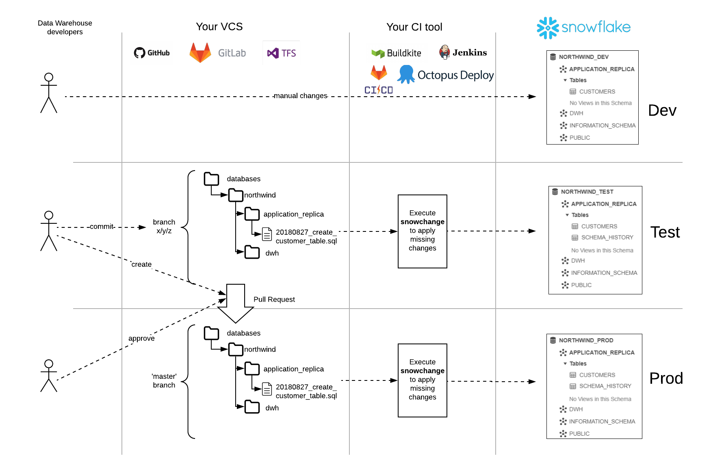

# snowchange


## Overview

snowchange is a simple python based tool to manage all of your [Snowflake](https://www.snowflake.com/) objects. It follows an Imperative-style approach to Database Change Management (DCM) and was inspired by the [Flyway database migration tool](https://flywaydb.org). When combined with a version control system and a CI/CD tool, database changes can be approved and deployed through a pipeline using modern software delivery practices. As such snowchange plays a critical role in enabling Database (or Data) DevOps.

DCM tools (also known as Database Migration, Schema Change Management, or Schema Migration tools) follow one of two approaches: Declarative or Imperative. For a background on Database DevOps, including a disucssion on the differences between the Declarative and Imperative approaches, please read the [Embracing Agile Software Delivery and DevOps with Snowflake](https://www.snowflake.com/blog/embracing-agile-software-delivery-and-devops-with-snowflake/) blog post.

## Table of Contents

1. [Project Structure](#project-structure)
   1. [Folder Structure](#folder-structure)
   1. [Database Mapping](#database-mapping)
1. [Change Scripts](#change-scripts)
   1. [Script Naming](#script-naming)
   1. [Change History Table](#change-history-table)
1. [Using snowchange](#using-snowchange)
   1. [Permissions](#permissions)
   1. [Running The Script](#running-the-script)
   1. [Parameters](#parameters)
1. [Integrating With DevOps](#integrating-with-devops)
   1. [Using in a CI/CD Pipeline](#using-in-a-cicd-pipeline)
1. [Maintainers](#maintainers)
1. [Legal](#legal)


## Project Structure

### Folder Structure

snowchange expects a directory structure like the following to exist:
```
(project_root)
|
|-- database_1
    |-- folder_1
    |   |-- V1.1.1__first_change.sql
    |   |-- V1.1.2__second_change.sql
    |-- folder_2
        |-- V1.1.3__third_change.sql
        |-- V1.1.4__fourth_change.sql
```

The folder structure is very flexible; the only requirement is that the first level of folders under the project root (specified with the `-f` or `--root-folder` argument) correspond to database names. Within a database folder there are no further requirements. snowchange will recursively find all change scripts and sort them by version. How you manage the scripts within each database folder is up to you.

### Database Mapping 

By default the name of the first level folder is used as the database name, as shown above. If you add the `-n` flag (or `--append-environment-name`) then the environment name (specified in the `-e` or `--environment-name` argument) will be appended to the database name with an underscore. This can be used to support multiple environments (dev, test, prod) within the same Snowflake account.

## Change Scripts

### Script Naming

Change scripts follow a similar naming convention to that used by [Flyway Versioned Migrations](https://flywaydb.org/documentation/migrations#versioned-migrations). The script name must follow this pattern (image taken from [Flyway docs](https://flywaydb.org/documentation/migrations#versioned-migrations)):


With the following rules for each part of the filename:

* **Prefix**: The letter 'V' for versioned change
* **Version**: A unique version number with dots or underscores separating as many number parts as you like
* **Separator**: __ (two underscores)
* **Description**: An arbitrary description with words separated by underscores or spaces (can not include two underscores)
* **Suffix**: .sql

For example, a script name that follows this convention is: `V1.1.1__first_change.sql`. 

As with Flyway, the unique version string is very flexible. You just need to be consistent and always use the same convention, like 3 sets of numbers separated by periods. Here are a few valid version strings:

* 1
* 5.2
* 1.2.3.4.5.6.7.8.9
* 205.68
* 20130115113556
* 2013.1.15.11.35.56

Every script within a database folder must have a unique version number. snowchange will check for duplicate version numbers and throw an error if it finds any. This helps to ensure that developers who are working in parallel don't accidently (re-)use the same version number.

### Change History Table

Every database will have a table automatically created to track the history of changes applied. The table `CHANGE_HISTORY` will be created within a `SNOWCHANGE` schema. The structure of the `CHANGE_HISTORY` table is as follows:

Column Name | Type |  Example
--- | --- | ---
INSTALLED_RANK | NUMBER | 1
VERSION | VARCHAR | 1.1.1
DESCRIPTION | VARCHAR | first_change
TYPE | VARCHAR | V
SCRIPT | VARCHAR | V1.1.1__first_change.sql
CHECKSUM | VARCHAR | 38e5ba03b1a6d2...
INSTALLED_BY | VARCHAR | SNOWFLAKE_USER
INSTALLED_ON | TIMESTAMP_LTZ | 2020-03-17 12:54:33.056 -0700
EXECUTION_TIME | NUMBER | 4
STATUS | VARCHAR | Success

A new row will be added to this table everytime a change script has been applied to the database. snowchange will use this table to idenitfy which changes have been applied to the database and will ot apply the same one twice.

## Using snowchange

### Permissions

In order to run snowchange you will need to use a user account that has the ```CREATE DATABASE``` account-level permission. 

### Running The Script

snowchange is a single python script named [snowchange.py](snowchange.py). It can be executed as follows:

```
python snowchange.py [-h] [-f ROOT_FOLDER] -e ENVIRONMENT_NAME [-n] -a SNOWFLAKE_ACCOUNT --snowflake-region SNOWFLAKE_REGION -u SNOWFLAKE_USER -r SNOWFLAKE_ROLE -w SNOWFLAKE_WAREHOUSE [-v]
```

The Snowflake user password for `SNOWFLAKE_USER` is required to be set in the environment variable `SNOWSQL_PWD` prior to calling the script. snowchange will fail if the `SNOWSQL_PWD` environment variable is not set.

### Parameters

Here is the list of supported parameters to the script:

Parameter | Description
--- | ---
-h, --help | Show the help message and exit
-f ROOT_FOLDER, --root-folder ROOT_FOLDER| *(Optional)* The root folder for the database change scripts. The default is the current directory.
-e ENVIRONMENT_NAME, --environment-name ENVIRONMENT_NAME | The name of the environment (e.g. dev, test, prod)
-n, --append-environment-name | *(Optional)* Append the --environment-name to the database name
-a SNOWFLAKE_ACCOUNT, --snowflake-account SNOWFLAKE_ACCOUNT | The name of the snowflake account (e.g. ly12345)
--snowflake-region SNOWFLAKE_REGION | The name of the snowflake region (e.g. ap-southeast-2)
-u SNOWFLAKE_USER, --snowflake-user SNOWFLAKE_USER | The name of the snowflake user (e.g. DEPLOYER)
-r SNOWFLAKE_ROLE, --snowflake-role SNOWFLAKE_ROLE | The name of the role to use (e.g. DEPLOYER_ROLE)
-w SNOWFLAKE_WAREHOUSE, --snowflake-warehouse SNOWFLAKE_WAREHOUSE | The name of the warehouse to use (e.g. DEPLOYER_WAREHOUSE)
-v, --verbose | Display verbose debugging details during execution

## Integrating With DevOps

Here is a sample DevOps development lifecycle with snowchange:



### Using in a CI/CD Pipeline

If your build agent has python 3 installed, the script can be ran like so:
```
pip install --upgrade snowflake-connector-python
python snowchange.py [-h] [-f ROOT_FOLDER] -e ENVIRONMENT_NAME [-n] -a SNOWFLAKE_ACCOUNT --snowflake-region SNOWFLAKE_REGION -u SNOWFLAKE_USER -r SNOWFLAKE_ROLE -w SNOWFLAKE_WAREHOUSE [-v]
```

Or if you prefer docker, set the environment variables and run like so:
```
docker run -it --rm \
  --name snowchange-script \
  -v "$PWD":/usr/src/snowchange \
  -w /usr/src/snowchange \
  -e ROOT_FOLDER \
  -e ENVIRONMENT_NAME \
  -e SNOWFLAKE_ACCOUNT \
  -e SNOWFLAKE_USER \
  -e SNOWFLAKE_ROLE \
  -e SNOWFLAKE_WAREHOUSE \
  -e SNOWFLAKE_REGION \
  -e SNOWSQL_PWD \
  python:3 /bin/bash -c "pip install --upgrade snowflake-connector-python && python snowchange.py -f $ROOT_FOLDER -e $ENVIRONMENT_NAME -a $SNOWFLAKE_ACCOUNT --snowflake-region $SNOWFLAKE_REGION -u $SNOWFLAKE_USER -r $SNOWFLAKE_ROLE -w $SNOWFLAKE_WAREHOUSE"
```

Either way, don't forget to set the `SNOWSQL_PWD` environment variable!

## Maintainers

- James Weakley (@jamesweakley)
- Jeremiah Hansen (@jeremiahhansen)

This is a community-developed script, not an official Snowflake offering. It comes with no support or warranty. However, feel free to raise a github issue if you find a bug or would like a new feature.

## Legal

Licensed under the Apache License, Version 2.0 (the "License"); you may not use this connector except in compliance with the License. You may obtain a copy of the License at: [http://www.apache.org/licenses/LICENSE-2.0](http://www.apache.org/licenses/LICENSE-2.0)

Unless required by applicable law or agreed to in writing, software distributed under the License is distributed on an "AS IS" BASIS, WITHOUT WARRANTIES OR CONDITIONS OF ANY KIND, either express or implied. See the License for the specific language governing permissions and limitations under the License.
